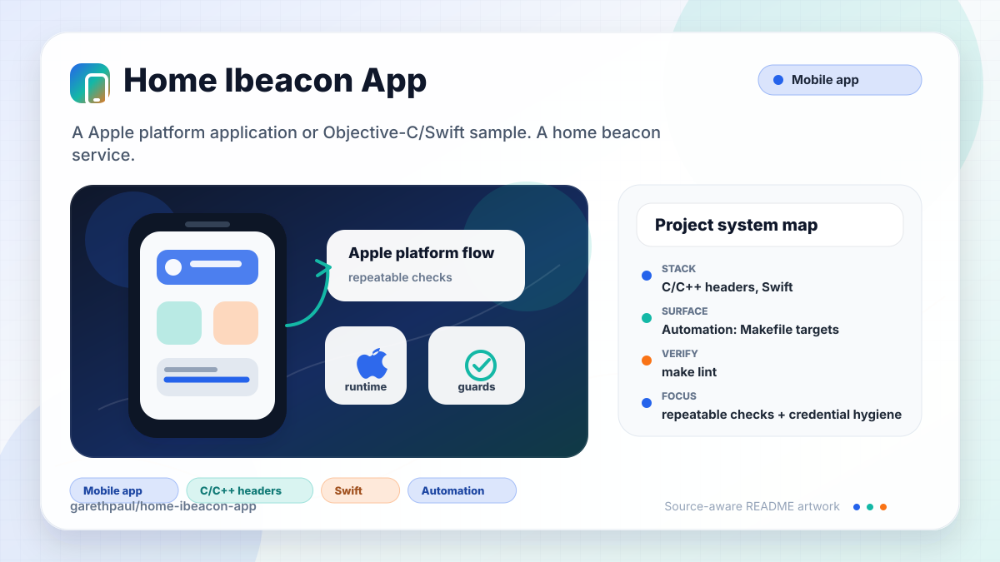

# home-ibeacon-app

<!-- README-OVERVIEW-IMAGE -->


## Overview

`garethpaul/home-ibeacon-app` is a Apple platform application or Objective-C/Swift sample. A home beacon service. Sends a HTTP request to a server if you enter or leave a "region". 

This README is based on the checked-in source, manifests, scripts, and repository metadata on the `master` branch. The project language mix found during review was: C/C++ headers (96), Swift (8).

## Repository Contents

- `CHANGES.md` - concise history of maintenance changes
- `Makefile` - local verification entry point
- `Podfile` - Apple platform dependency metadata
- `Fabric.framework` - source or example code
- `HomeBeacon` - source or example code
- `HomeBeacon.xcodeproj` - Xcode project file
- `HomeBeacon.xcworkspace` - Xcode workspace including the CocoaPods project
- `HomeBeaconTests` - source or example code
- `Podfile.lock` - Apple platform dependency metadata
- `SECURITY.md` - security reporting and disclosure guidance
- `scripts/check-baseline.py` - static iOS privacy and project verifier
- `TwitterKit.framework` - source or example code
- `VISION.md` - project direction and maintenance guardrails

Additional scan context:

- Source directories: Fabric.framework, HomeBeacon, HomeBeaconTests, TwitterKit.framework
- Dependency and build manifests: Podfile, Podfile.lock
- Entry points or build surfaces: `make check`, HomeBeacon.xcworkspace, HomeBeacon.xcodeproj
- Test-looking files: HomeBeacon/HomeBeaconTests/HomeBeaconTests.swift, HomeBeacon/HomeBeaconTests/Info.plist, HomeBeaconTests/HomeBeaconTests.swift, HomeBeaconTests/Info.plist

## Getting Started

### Prerequisites

- Git
- macOS with Xcode for building Apple platform projects
- CocoaPods 0.37.0 beta era tooling if dependencies need to be regenerated
- Python 3 for local static verification on non-macOS hosts

### Setup

```bash
git clone https://github.com/garethpaul/home-ibeacon-app.git
cd home-ibeacon-app
make check
```

The repository includes legacy CocoaPods output and lockfiles. Run `pod install` only from a compatible CocoaPods environment when you intentionally need to regenerate the checked-in Pods project.

## Running or Using the Project

- Open `HomeBeacon.xcworkspace` in Xcode so the app and CocoaPods projects are loaded together.
- Provide Fabric/Twitter values through local Xcode build settings or environment-backed xcconfig values:
  - `FABRIC_API_KEY`
  - `FABRIC_BUILD_SECRET`
  - `TWITTER_CONSUMER_KEY`
  - `TWITTER_CONSUMER_SECRET`
- Use a physical device for meaningful iBeacon enter/exit verification. Simulator checks are useful for launch and UI smoke tests but not beacon behavior.

## Testing and Verification

Run the local static baseline:

```bash
make check
```

The baseline runs `scripts/check-baseline.py`, parses plist/storyboard/workspace XML, checks CocoaPods lockfile consistency, verifies the legacy Swift and vendor inventory, and guards against committed Fabric/Twitter credential literals, phone-number debug logging, dormant phone-number payload assembly, active location-state device logs, active lock-screen local notifications for beacon state, retained local notification scheduling code, unused local notification permission prompts, active home/away POST calls, and invalid hex color parser fallthrough.

For full legacy verification on macOS, use Xcode's test action or `xcodebuild test` with the appropriate scheme and destination.

When the required SDK or runtime is unavailable, use static checks and source review first, then verify on a machine that has the matching platform toolchain.

## Configuration and Secrets

- Detected references to Twitter. Keep API keys, OAuth credentials, tokens, and account-specific values in local configuration only.
- The current tree uses build-setting placeholders for Fabric and Twitter credentials. Do not replace `$(FABRIC_API_KEY)`, `$(TWITTER_CONSUMER_KEY)`, or `$(TWITTER_CONSUMER_SECRET)` with real values in tracked files.
- The Fabric upload build phase reads `FABRIC_API_KEY` and `FABRIC_BUILD_SECRET` locally and skips the upload when either value is unset.
- The sample beacon UUID and identifier are still checked into `HomeBeacon/AppDelegate.swift`; treat them as demo configuration and move private beacon values to local configuration before production use.

## Security and Privacy Notes

- Review changes touching authentication or token handling; examples from the scan include HomeBeacon/AppDelegate.swift, HomeBeacon/LoginViewController.swift, TwitterKit.framework/Headers/DGTAuthenticateButton.h, TwitterKit.framework/Headers/DGTContacts.h, and 6 more.
- Review changes touching external API calls or credential-adjacent configuration; examples from the scan include Fabric.framework/Headers/Fabric.h, Fabric.framework/Resources/Info.plist, Fabric.framework/Versions/A/Headers/Fabric.h, Fabric.framework/Versions/A/Resources/Info.plist, and 6 more.
- Review changes touching network requests, sockets, or service endpoints; examples from the scan include Fabric.framework/Resources/Info.plist, Fabric.framework/Versions/A/Resources/Info.plist, Fabric.framework/Versions/Current/Resources/Info.plist, HomeBeacon/AppDelegate.swift, and 6 more.
- Review changes touching mobile permissions or privacy-sensitive device data; examples from the scan include HomeBeacon/HomeBeacon/Info.plist, HomeBeacon/Info.plist, TwitterKit.framework/Headers/DGTContactAccessAuthorizationStatus.h, TwitterKit.framework/Headers/DGTContacts.h, and 6 more.
- Review changes touching file, media, JSON, XML, CSV, OCR, or data parsing; examples from the scan include Fabric.framework/Resources/Info.plist, Fabric.framework/Versions/A/Resources/Info.plist, Fabric.framework/Versions/Current/Resources/Info.plist, HomeBeacon/HomeBeacon/Info.plist, and 6 more.
- Review changes touching database, model, or persistence code; examples from the scan include TwitterKit.framework/Headers/TWTRTweetTableViewCell.h, TwitterKit.framework/Headers/TWTRTweetViewDelegate.h, TwitterKit.framework/Versions/A/Headers/TWTRTweetTableViewCell.h, TwitterKit.framework/Versions/A/Headers/TWTRTweetViewDelegate.h, and 2 more.
- Beacon enter/exit state can reveal home occupancy. Do not re-enable network reporting until the endpoint, consent model, retention behavior, and HTTPS transport are documented.
- Do not re-enable home/away or proximity `NSLog` calls; device logs can expose occupancy during debugging or shared diagnostics.
- Do not re-enable home/away or proximity local notifications without explicit user-facing consent; lock-screen alerts can expose occupancy.
- Do not request local notification permission while beacon-state notifications
  are disabled; permission prompts imply user-facing lock-screen behavior.
- Do not retain local notification scheduling helpers while beacon-state
  notifications are disabled; unused helper code makes re-enabling easier to
  miss in review.

## Maintenance Notes

- This looks like an Apple platform project or sample. Xcode, Swift, CocoaPods, and deployment target versions may need to match the original project era.
- See `SECURITY.md` for vulnerability reporting and safe research guidance.
- See `VISION.md` for project direction and contribution guardrails.
- See `docs/plans/2026-06-08-location-log-privacy.md` for the location-state device log guardrail.
- See `docs/plans/2026-06-09-location-notification-privacy.md` for the location-state local notification guardrail.
- See `docs/plans/2026-06-09-location-notification-permission.md` for the local notification permission guardrail.
- See `docs/plans/2026-06-09-location-notification-code-removal.md` for the local notification scheduling guardrail.
- See `docs/plans/2026-06-08-hex-parser-invalid-input.md` for the UI hex parser invalid-input guardrail.
- Run `make check` before pushing changes to plist files, Swift sources, CocoaPods metadata, credential handling, or location behavior.

## Contributing

Keep changes small and tied to the project that is already present in this repository. For code changes, document the toolchain used, avoid committing generated dependency directories or local configuration, and update this README when setup or verification steps change.
